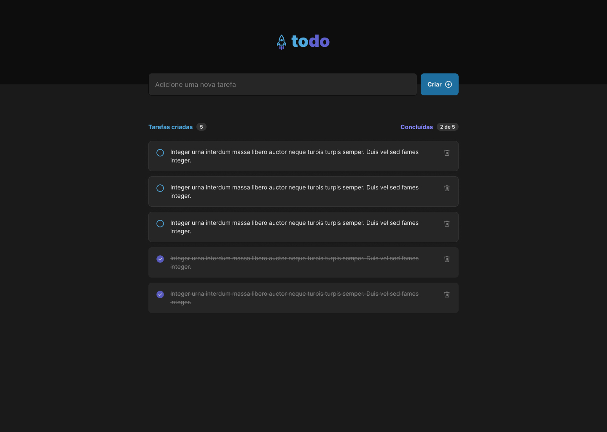

<h1 align="center">
    
</h1>


<p align="center">
 <a href="#-sobre-o-projeto">Sobre</a> •
 <a href="#-funcionalidades">Funcionalidades</a> •
 <a href="#-como-executar-o-projeto">Como executar</a> • 
 <a href="#-tecnologias">Tecnologias</a> • 
</p>


## 💻 Sobre o projeto

ToDo List é uma aplicação web para criação e controle de tarefas.
Esse é um projeto dos desafios da trilha de React do Ignite, o bootcamp completo realizado pela Rocketseat. 

---

## ⚙️ Funcionalidades

- [x] Adicionar uma nova tarefa
- [x] Marcar e desmarcar uma tarefa como concluída
- [x] Remover uma tarefa da listagem
- [x] Mostrar o progresso de conclusão das tarefas
---


## 🚀 Como executar o projeto

### Pré-requisitos

Antes de começar, você vai precisar ter instalado em sua máquina as seguintes ferramentas:
[Git](https://git-scm.com), [Node.js](https://nodejs.org/en/). 
Além disto é bom ter um editor para trabalhar com o código como [VSCode](https://code.visualstudio.com/)


#### 🧭 Rodando a aplicação web

```bash

# Clone este repositório
$ git clone git@github.com:peterhfss/ignite-reactjs-challenge01-todo-list.git

# Acesse a pasta do projeto no seu terminal/cmd
$ cd ignite-reactjs-challenge01-todo-list

# Instale as dependências
$ npm install

# Execute a aplicação em modo de desenvolvimento
$ npm run dev

# A aplicação será aberta na porta:3000 - acesse http://localhost:3000

```

---

## 🛠 Tecnologias

As seguintes ferramentas foram usadas na construção do projeto:

#### **Website**  ([React](https://reactjs.org/)  +  [TypeScript](https://www.typescriptlang.org/))


-   **[React Icons](https://react-icons.github.io/react-icons/)**


---